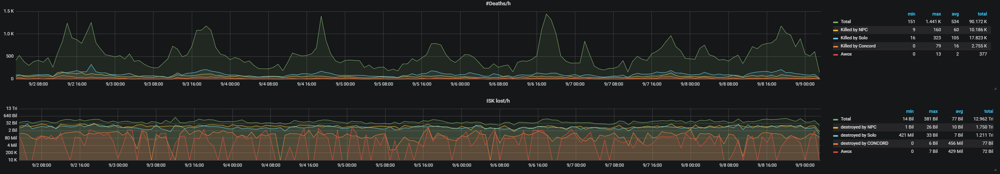
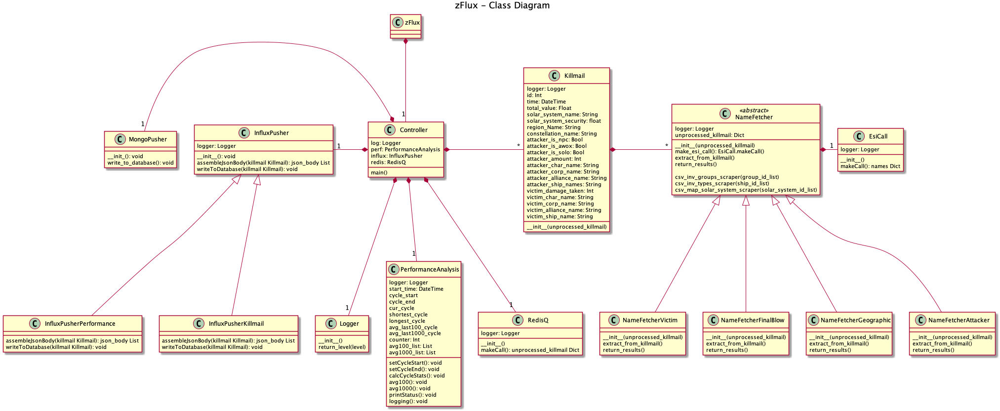

# zFlux
Pulls every kill [zKill](https://zkillboard.com) gets and puts them into a 
[InfluxDB](https://www.influxdata.com/time-series-platform/influxdb/)
for making nice graphs. It can also Cache every incoming Killmail in a [MongoDB](https://www.mongodb.com/).
 

Example Graphs made with [Grafana](https://grafana.com):




## Requirements

#### Python3

##### required packages:
```
influxdb
requests
pymongo
eve-verbose-killmail
```
Install with with ``pip3 install -r requirements.txt``

If you don't have pip3 installed install it with ``sudo apt-get install python3-pip``

##### [InfluxDB](https://www.influxdata.com/time-series-platform/influxdb/)
You will want a machine with Influx running. The script checks if there is a database called
'eve' and will otherwise create one. I recommend at least 4GB of RAM on your machine, though 
it might not enough if you plan to run the script longterm.
You will also want to disable the series limit in the config.

##### [MongoDB](https://www.mongodb.com/)
If enabled in the config you need a MongoDB Server running on your machine.


## Getting started

##### Edit the config.json

Edit the config to your needs.

*Note:* ``disable_logging`` doesnt do anything yet
````
{
  "logging_level": "INFO",
  "disable_logging": false,
  "enable_performance_logging": true,
  "enable_mongodb": true,
  "enable_influxdb": true,

  "influx": {
    "ip": "localhost",
    "port": 8086,
    "database_name": "eve"
  },
  
  "mongo": {
    "ip": "localhost",
    "port": 27017,
    "database_name": "eve"
  }
}
````
##### run the script

``python3 zFlux.py``

##### Autorun the Script on system startup

I supply a default unit file. For it to work you have to edit the ``WorkingDirectory=`` path and the ``ExecStart=`` path
to your installation location in ``zFlux.service``.

Copy the unit file ``zFlux.service`` to the correct directory:

````sudo cp /your/path/zFlux/zFlux.service /lib/systemd/system/````

Then set the right permissions on that file:

````sudo chmod 644 /lib/systemd/system/zFlux.service````

Then enable the service:
````
sudo systemctl daemon-reload
sudo systemctl enable zFlux.service
````

Then reboot:

````sudo reboot````

The script should now autostart on system startup.

If you want to check the status of the script:

``sudo systemctl status zFlux.service``


## Available Data Points

### eve

##### measurement
``
kills
``

##### tags
```
solar_system_name
solar_system_security
solar_system_class
region_name
constellation_name

value_total
value_fitted
value_ship

final_blow_damage
final_blow_damage_percent
final_blow_ship_name
final_blow_ship_group_name

final_blow_ship_name
final_blow_ship_group_id
final_blow_ship_group_name

attacker_amount
attacker_corp_names
attacker_alliance_names
attacker_is_npc
attacker_is_solo
attacker_is_awox
attacker_ship_names
attacker_ship_grouo_names

victim_char_name
victim_corp_name
victim_alliance_name
victim_ship_name
victim_ship_group_name
victim_damage_taken
```
##### fields

```
#kills

solar_system_security

value_total
value_fitted
value_ship

final_blow_damage
final_blow_damage_percent

attacker_amount

victim_damage_taken
```

### performance

##### measurement
``
performance
``

##### tags
``
``
##### fields
````
#cycle
cycle_time
shortest_cycle
longest_cycle
avg100
avg1000
counter
````

## Class Diagram


