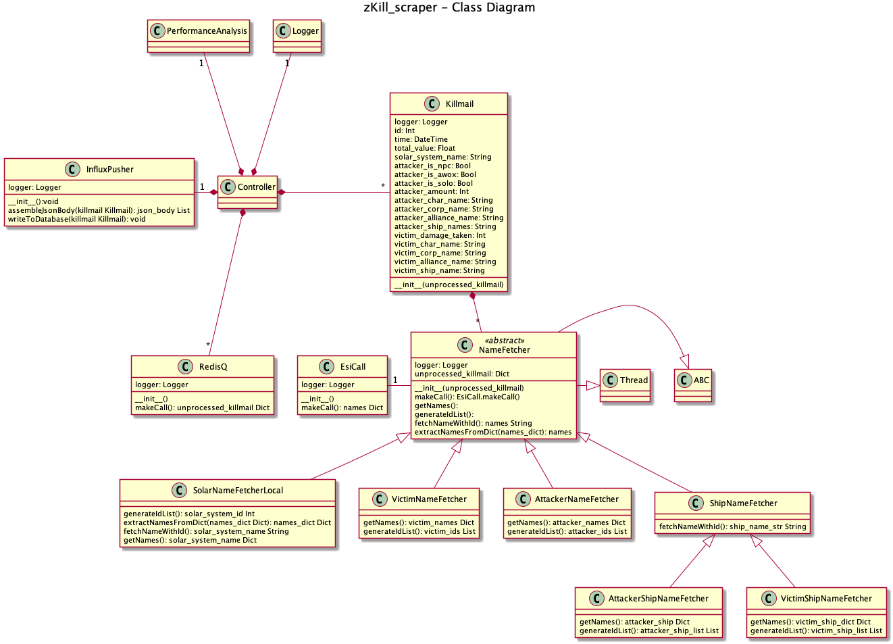

# zKill_scraper
Pulls every kill zKill gets and puts them into a InfluxDB

Usage:
```
python3 main.py
```

## Class Diagram


## Requirements

#### Python3
Only tested on python 3.7.
##### required modules:
```
influxdb
requests
```
##### InfluxDB
You will want a machine with Influx running. The script checks if there is a database called
'eve' and will otherwise create one. I recommend at least 4GB of RAM on your machine, though 
it might not enough if you plan to run the script longterm.
You also will want to disable the series limit in the config.


## Set logging level

To not get too big logfiles you may set the logging level higher in main.py. Current Level is INFO.
Other available logging levels:
  ```
  INFO
  WARNING
  ERROR
  ```
  ```
  logging.basicConfig(filename ='zKill_scraper_{}.log'.format(start), level = logging.DEBUG, format='%(asctime)s %(levelname)s:%(message)s')
  ```

## Available Data Points

#### Tags

###### General Information
```
solar_system_name
```

###### Attacker Information
```
attacker_char_name
attacker_corp_name
attacker_alliance_name
attacker_is_npc
attacker_is_solo
attacker_is_awox
attacker_ship_name
```

###### Victim Information
```
victim_char_name
victim_corp_name
victim_alliance_name
victim_ship_name
```
#### Fields

```
#kills
totalValue
victim_damage_taken
```
